# Project 0 - Tuan Anh Nguyen

> "Store App" is a Console Application used to help ease your shopping.

# Table of Contents
- [Project 0 - Tuan Anh Nguyen](#project-0---tuan-anh-nguyen)
- [Table of Contents](#table-of-contents)
- [Features](#features)
  - [Customers](#customers)
  - [Stores](#stores)
  - [Admin/Manager](#adminmanager)
- [Technologies](#technologies)
- [Setting Up & Run the app in your own machine](#setting-up--run-the-app-in-your-own-machine)
  - [Database Setup Section](#database-setup-section)
  - [Query Scripting Section](#query-scripting-section)
    - [Cloud Query](#cloud-query)
  - [Configuration Section](#configuration-section)
    - [Connection Strings](#connection-strings)
- [Changelog](#changelog)
  - [v1.0.0](#v100)
- [Contributing](#contributing)
- [Contacts](#contacts)

# Features
There are 3 main group users in this project:
## Customers
- Sign Up/Sign In(No need password now)
- Edit Profile
- Choose where to shop and place a new order
- Check Orders History
## Stores
- Sign Up/Sign In(No need password now)
- Import new product to store
- Check Inventory
- Replenish Inventory
- Check Orders History
## Admin/Manager
- Add new product to the system
- Edit product information

# Technologies
- [C#](https://docs.microsoft.com/en-us/dotnet/csharp/tour-of-csharp/)
- [LINQ](https://docs.microsoft.com/en-us/dotnet/csharp/programming-guide/concepts/linq/)
- [Visual Studio Code](https://code.visualstudio.com)
- [DBeaver](https://dbeaver.io)
- [Git](https://git-scm.com)
- [Markdown](https://daringfireball.net/projects/markdown/)

# Setting Up & Run the app in your own machine
## Database Setup Section
Here I use [Microsoft Azure SQL Database](https://portal.azure.com/) for my project, but you are free to use anything you like.

After signed in(I do recommended you to use a free subscription for this project :D), here is your Portal(yours might be a little bit different with mine but the only thing we care is "SQL Databases", so just focus on it):

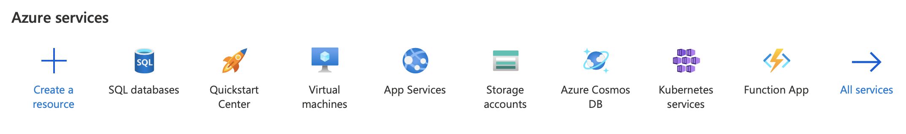

Click on "SQL Databases" and then click "Create" to create a new database:

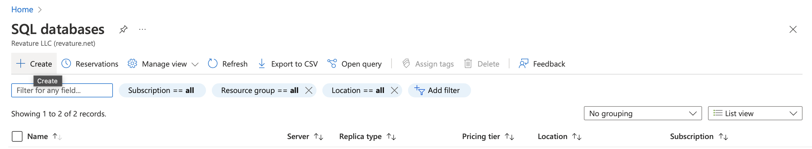

In "Basics" page, create a new "Resoure group" if you don't have one yet:

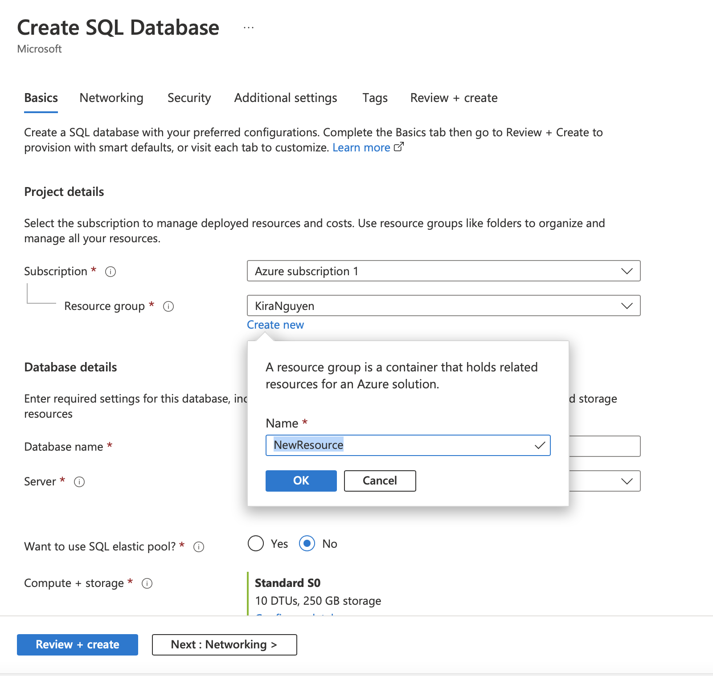

Put your "Database name", and create a new "Server" as well if you don't have one:

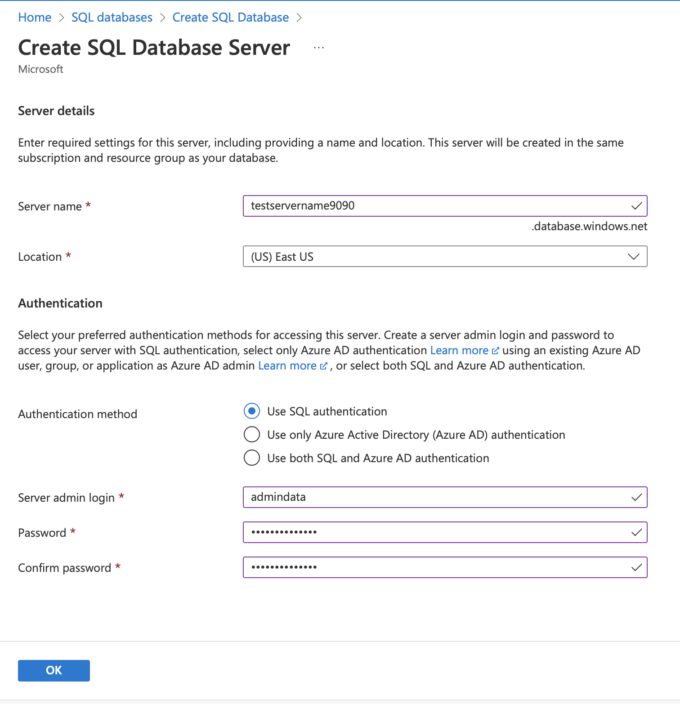

Use "SQL authentication" option and then fill all the information. Please remember or save your password some where because we will need it later for setting up. Click "Ok".

Here will be the most important part, "Compute + storage", click on "Configure database":

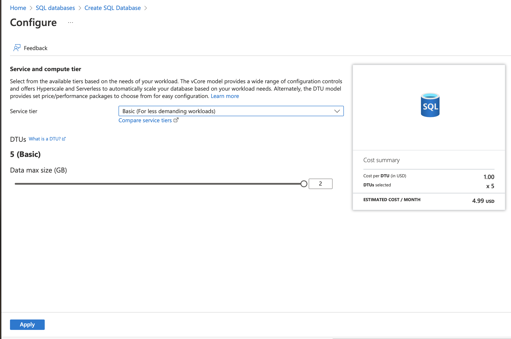

And then choose the "Basic tier", then click on "Apply".

The above steps will help you a little bit, incase you want to keep the database after one "free" month, so the cost will be minimum at $4.99/month. But you totally can delete the database after have some "fun" with the project with no cost.

We done for the first page, now click on "Next : Networking >". 
You will need to change the "Network connectivity" to "Public endpoint", and the "Firewall rules" to all "Yes". Yours should be the same with the screenshot below:

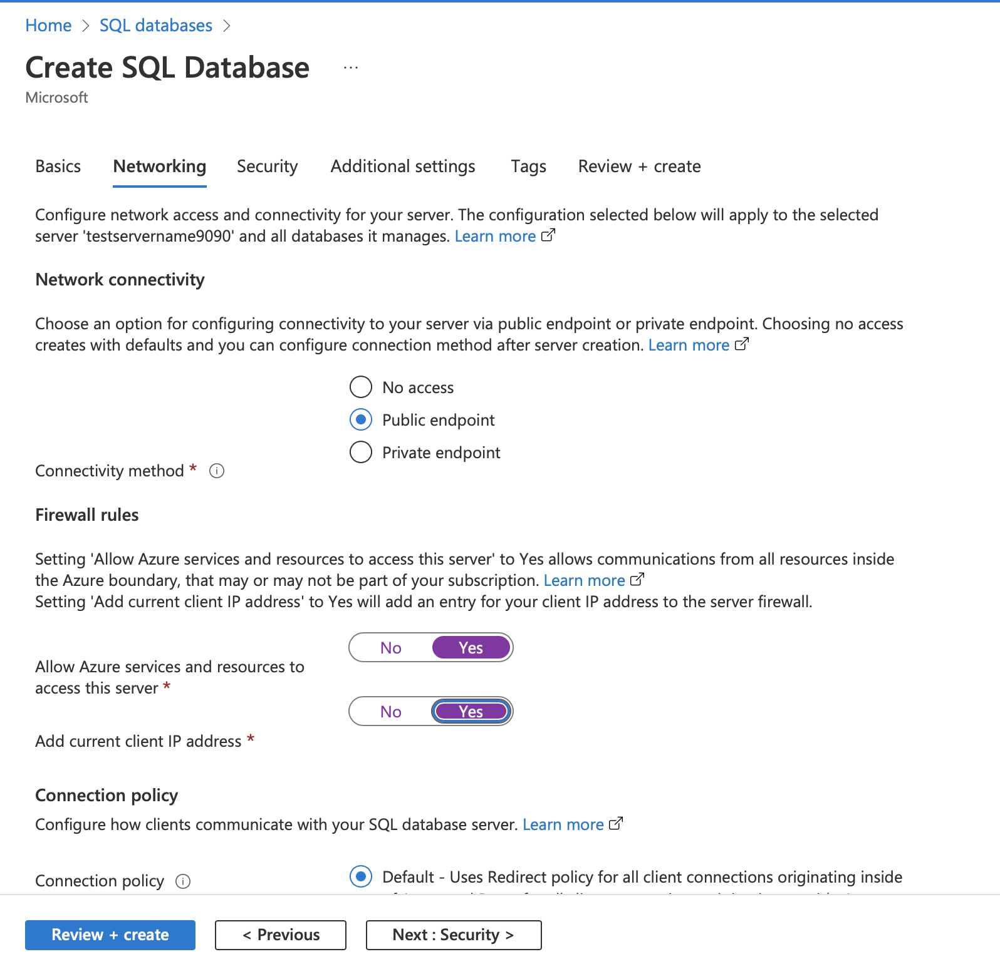

Then, click "Review + create". Please check all the information, it should look like the screenshot below:

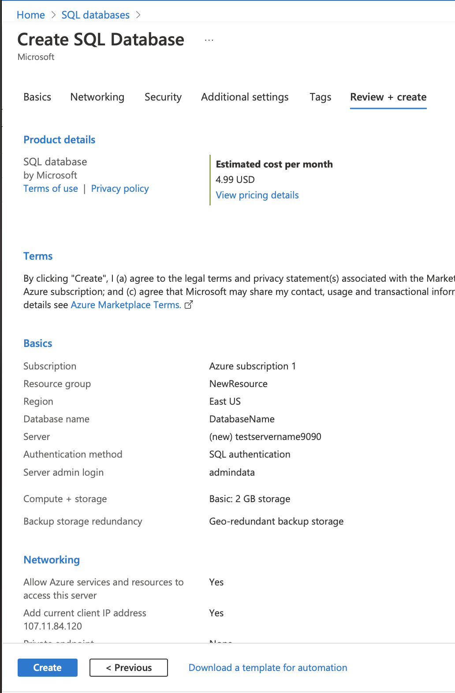

And finally, click "Create"!
After the Deploument is done, you can see your Database is now available to deploy, and then click "Go to resource":

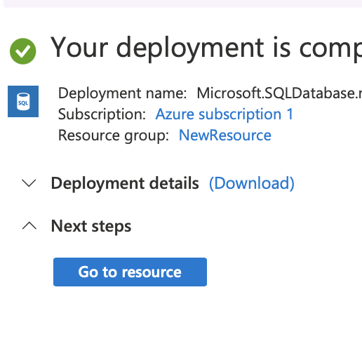

The section we care here is "Connection strings", you can find it in the left sidebar:

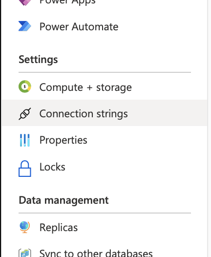

Copy and save all the text in the box "ADO.NET (SQL authentication)" to where you saved your SQL server admin password before. Replace "{your_password}" in text with your password.

We done for the Azure Database setup part!

## Query Scripting Section
The way I show you below don't need any setup to query, but you definitely can use [VSCode](https://code.visualstudio.com) or [DBeaver](https://dbeaver.io),... to run the query as well. If you need help to setup the connection from Azure to your VSCode, please contact me.

### Cloud Query
Click to the "Query editor" section in the left sidebar(Azure Portal):

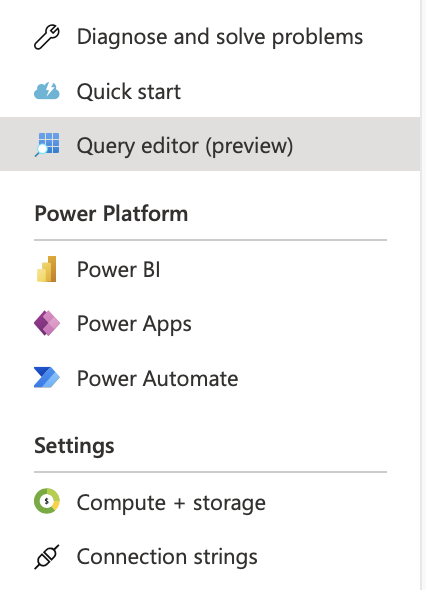

Copy everything from the [SQL Script Creating Tables File](assets/SQLScript/SQLScripts.sql) into the box and then click "Run":

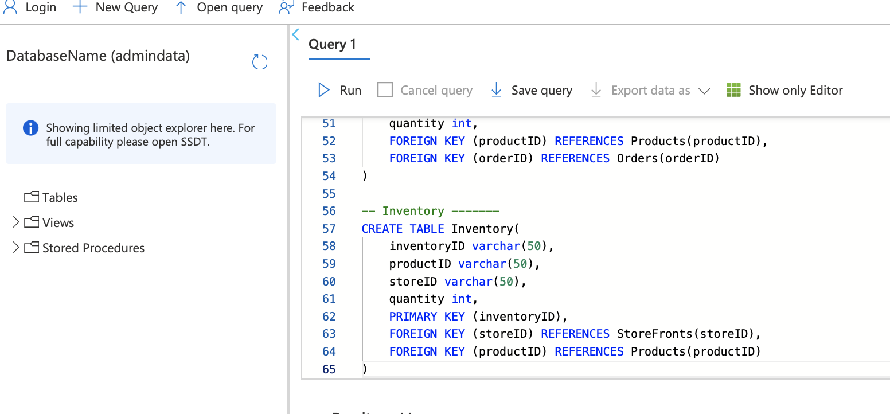

After query succeeded, you can click on the "Refresh" icon and you should see the result below:

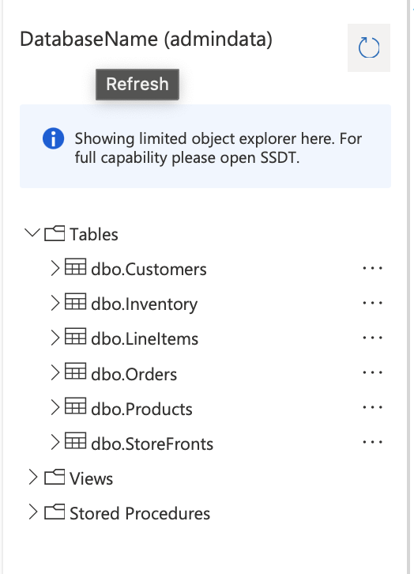

Done for the Query Section!

## Configuration Section
After you setup your cloud database, you will need to edit and add some files to make the project works in your own machine.
### Connection Strings
```C#
// In UI/Program.cs file, edit these lines below

var configuration = new ConfigurationBuilder()
                        .SetBasePath(Directory.GetCurrentDirectory())
                        .AddJsonFile({jsonfilename})
                        .Build();

string _connectionString = configuration.GetConnectionString(key);

/** Where
jsonfilename - your appsettings.json file path.
key - name of the key in ConnectionString. 
**/

-------------------------------------------
// Create appsettings.json file
// And REMEMBER don't upload this file to cloud. You might have some unauthorized access to your Database since your connectionString is now visile.
{
    "ConnectionStrings": {
        "key": "your connectionString ADO.NET from Azure"
    }
}
```
Done :D Enjoy it!

# Changelog
## v1.0.0
- Release

# Contributing
As I did this project for the course, so if you want to have more features, please give me a request or just [open an issue]([issues](https://github.com/220118-Reston-NET/TuanAnh-Nguyen-P0/issues)) and tell me your ideas.

# Contacts
- Github: [@kirasn](https://github.com/kirasn)
- Website: [http://www.kiranguyen.com](http://www.kiranguyen.com)
